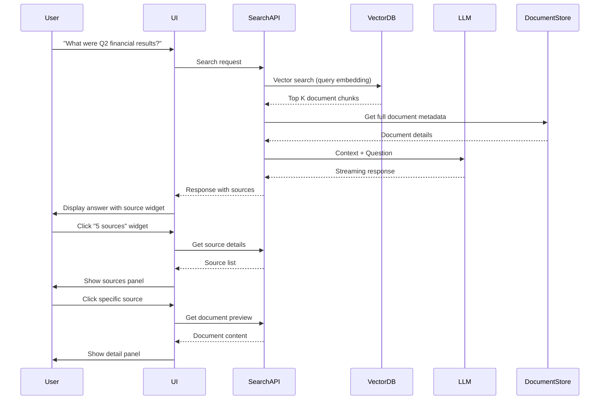

# Email with PDF Attachment Processing Flow

This document explains how an email with a PDF attachment is processed through the LoseMe system, covering extraction, indexing, search, and LLM enrichment.

## 1. Email Ingestion

### Process: Email Reception
- **Input**: Incoming email with PDF attachment
- **Trigger**: Email server receives message
- **Actions**:
  - Parse email headers (From, To, Subject, Date)
  - Extract email body content
  - Identify and separate attachments
  - Validate file types and sizes

### Process: Attachment Extraction
- **Input**: PDF file attachment
- **Actions**:
  - **Unique ID Generation**: Create document ID based on:
    - Email message ID (if available)
    - File hash (SHA-256 of PDF content)
    - Timestamp + random suffix
    - Example: `email_<message-id>_<hash>_<timestamp>.pdf`
  - **Metadata Extraction**:
    - Original filename
    - File size
    - MIME type
    - Creation/modification dates
    - Email subject and sender
  - **Content Extraction**:
    - Use PDF parsing library to extract text
    - Preserve document structure (headings, paragraphs, tables)
    - Extract embedded images (if any)
    - Store raw text and structured content

## 2. Document Processing

### Process: Text Normalization
- **Input**: Raw extracted text
- **Actions**:
  - Clean and normalize text
  - Remove excessive whitespace
  - Standardize encoding (UTF-8)
  - Language detection
  - Basic NLP preprocessing (tokenization, lemmatization)

### Process: Chunking
- **Input**: Normalized text
- **Actions**:
  - **Chunk Creation**: Split document into semantic chunks
    - Ideal chunk size: 500-1000 tokens
    - Preserve paragraph boundaries
    - Maintain context between chunks
    - Overlap chunks by 100-200 tokens for continuity
  - **Chunk Metadata**:
    - `chunk_id`: `<document_id>_chunk_<sequence>`
    - `document_id`: Reference to parent document
    - `sequence`: Position in document (0, 1, 2...)
    - `token_count`: Number of tokens in chunk
    - `content_hash`: Hash of chunk content

### Process: Embedding Generation
- **Input**: Text chunks
- **Actions**:
  - **Vector Embedding**: Convert text to numerical vectors
    - Use pre-trained embedding model
    - Generate 384-1536 dimensional vectors
    - Normalize vectors for efficient similarity search
  - **Embedding Storage**:
    - Store vectors in vector database
    - Create index for fast retrieval
    - Associate embeddings with chunk metadata

## 3. Indexing Pipeline

### Process: Document Indexing
- **Input**: Processed chunks with embeddings
- **Actions**:
  - **Database Records**:
    ```json
    {
      "document_id": "email_abc123_hash456_1234567890.pdf",
      "source_type": "email_attachment",
      "source_path": "/emails/inbox/2024/06/message_abc123",
      "original_filename": "Q2_Report.pdf",
      "mime_type": "application/pdf",
      "size_bytes": 2456789,
      "created_at": "2024-06-21T10:30:00Z",
      "updated_at": "2024-06-21T10:32:45Z",
      "metadata": {
        "email_subject": "Q2 Financial Report",
        "email_from": "finance@company.com",
        "email_to": "executives@company.com",
        "email_date": "2024-06-20T15:45:00Z",
        "page_count": 42,
        "language": "en"
      },
      "chunks": [
        {
          "chunk_id": "email_abc123_hash456_1234567890_chunk_0",
          "sequence": 0,
          "token_count": 782,
          "content_hash": "sha256:987654321...",
          "embedding": [0.123, 0.456, ..., 0.789],
          "content": "The Q2 financial report shows..."
        },
        {
          "chunk_id": "email_abc123_hash456_1234567890_chunk_1",
          "sequence": 1,
          "token_count": 856,
          "content_hash": "sha256:abcdef123...",
          "embedding": [0.234, 0.567, ..., 0.890],
          "content": "Revenue increased by 25% compared..."
        }
      ]
    }
    ```

### Process: Index Creation
- **Input**: Document records
- **Actions**:
  - **Vector Index**: Optimized for similarity search
    - HNSW (Hierarchical Navigable Small World)
    - IVF (Inverted File Index)
    - Product quantization for compression
  - **Metadata Index**: Fast filtering
    - Document ID lookup
    - Source type filtering
    - Date range queries
    - Custom metadata fields

## 4. Search Workflow

### Process: Query Processing
- **Input**: User search query
- **Actions**:
  - **Query Analysis**:
    - Extract keywords and intent
    - Determine search scope (all documents, specific types)
    - Apply filters (date ranges, source types)
  - **Vector Conversion**:
    - Convert query text to embedding vector
    - Use same embedding model as documents

### Process: Vector Search
- **Input**: Query embedding
- **Actions**:
  - **Similarity Search**:
    - Find closest vectors in index
    - Use cosine similarity metric
    - Return top K results (typically 10-20)
  - **Result Ranking**:
    - Score: 0.0 (dissimilar) to 1.0 (identical)
    - Filter by minimum relevance threshold
    - Apply business rules (recency, source priority)

### Process: Result Aggregation
- **Input**: Raw search results
- **Actions**:
  - **Deduplication**: Merge chunks from same document
  - **Context Building**: Combine related chunks
  - **Metadata Enrichment**: Add document context
  - **Response Formatting**: Prepare for LLM processing

## 5. LLM Enrichment

### Process: Context Construction
- **Input**: Search results
- **Actions**:
  - **Prompt Engineering**:
    ```
    Context:
    [Document 1: Q2_Report.pdf (Score: 0.92)]
    The Q2 financial report shows significant growth...
    
    [Document 2: Engagement_Analysis.xlsx (Score: 0.88)]
    User engagement metrics indicate...
    
    Question: What were the key findings from Q2?
    ```
  - **Token Management**:
    - Limit context to model's token window
    - Prioritize high-scoring documents
    - Truncate less relevant content

### Process: LLM Generation
- **Input**: Constructed prompt
- **Actions**:
  - **Model Selection**: Choose appropriate LLM
  - **Response Generation**:
    - Streaming response to user
    - Handle interruptions gracefully
    - Manage token limits
  - **Safety Checks**:
    - Content filtering
    - Hallucination detection
    - Confidence scoring

### Process: Response Enhancement
- **Input**: Raw LLM output
- **Actions**:
  - **Source Attribution**: Link to original documents
  - **Citation Generation**: Create proper references
  - **Formatting**: Apply markdown/HTML styling
  - **Metadata Injection**: Add response metadata

## 6. User Interaction Flow

### Hybrid Search Experience


## 7. Error Handling & Recovery

### Common Issues and Mitigations

| Issue | Detection | Recovery Strategy |
|-------|-----------|-------------------|
| Empty PDF | No text extracted | Notify user, skip processing |
| Corrupt PDF | Parsing failure | Attempt repair, quarantine if failed |
| Large PDF | Exceeds size limits | Split into multiple documents |
| Duplicate | Content hash match | Skip or update existing record |
| Search timeout | No results returned | Retry with broader parameters |
| LLM failure | API error | Fallback to search-only mode |

## 8. Performance Optimization

### Caching Strategies
- **Embedding Cache**: Store frequently used embeddings
- **Query Cache**: Cache common search results
- **Document Cache**: Cache full document previews
- **LLM Cache**: Cache frequent question-answer pairs

### Parallel Processing
- **Chunk Processing**: Process multiple chunks concurrently
- **Batch Indexing**: Index documents in batches
- **Asynchronous Updates**: Non-blocking metadata updates

## 9. Security Considerations

### Data Protection
- **Encryption**: AES-256 for data at rest
- **Access Control**: Role-based document access
- **Audit Logging**: Track all document access
- **Redaction**: Remove sensitive content automatically

### Privacy Compliance
- **GDPR**: Right to erasure implementation
- **Data Minimization**: Store only necessary metadata
- **Anonymization**: Remove personal identifiers when possible

## 10. Monitoring and Analytics

### Key Metrics
- **Processing Time**: Extraction → Indexing → Searchable
- **Search Latency**: Query → First result
- **Relevance Scores**: Average result quality
- **User Engagement**: Click-through rates on sources
- **Error Rates**: Failed processing attempts

### Continuous Improvement
- **Feedback Loop**: User ratings of search results
- **Model Retraining**: Periodic embedding model updates
- **Query Analysis**: Identify common search patterns

## Example: Complete Email+PDF Journey

### 1. Email Received
```
From: finance@company.com
To: executives@company.com
Subject: Q2 Financial Report
Date: 2024-06-20 15:45:00
Attachment: Q2_Report.pdf (2.3MB)
```

### 2. Processing Pipeline
```
1. Extract PDF → 42 pages of financial data
2. Generate document_id: email_msg12345_hash67890_1718900000
3. Create 28 chunks (avg 850 tokens each)
4. Generate embeddings for each chunk
5. Store in vector database with metadata
```

### 3. User Search
```
Query: "What was our revenue growth in Q2?"
→ Vector search finds 8 relevant chunks (scores 0.85-0.94)
→ LLM generates response with key metrics
→ User sees answer with "4 sources" widget
```

### 4. Source Exploration
```
User clicks widget → Sees source list:
1. Q2_Report.pdf (Page 5) - Score: 92%
2. Q2_Report.pdf (Page 12) - Score: 89%
3. Engagement_Analysis.xlsx - Score: 85%
4. Churn_Reduction_Plan.pptx - Score: 82%

User clicks first source → Sees full page content with highlighting
```

## Technical Architecture

```
┌─────────────────────────────────────────────────┐
│                 User Interface                   │
└─────────────────────────────────────────────────┘
                            │
                            ▼
┌─────────────────────────────────────────────────┐
│               Search API Layer                 │
│  ┌─────────────┐    ┌─────────────┐    ┌─────────┐ │
│  │ Query Parsing │    │ Result Aggregation │    │ Caching │ │
│  └─────────────┘    └─────────────┘    └─────────┘ │
└─────────────────────────────────────────────────┘
                            │
                            ▼
┌─────────────────────────────────────────────────┐
│               Vector Database                    │
│  ┌─────────────┐    ┌─────────────┐    ┌─────────┐ │
│  │ HNSW Index │    │ Metadata Store │    │ Embeddings │ │
│  └─────────────┘    └─────────────┘    └─────────┘ │
└─────────────────────────────────────────────────┘
                            │
                            ▼
┌─────────────────────────────────────────────────┐
│               Document Storage                  │
│  ┌─────────────┐    ┌─────────────┐    ┌─────────┐ │
│  │ Raw Content │    │ Processed Chunks │    │ Metadata │ │
│  └─────────────┘    └─────────────┘    └─────────┘ │
└─────────────────────────────────────────────────┘
                            │
                            ▼
┌─────────────────────────────────────────────────┐
│               LLM Integration                    │
│  ┌─────────────┐    ┌─────────────┐    ┌─────────┐ │
│  │ Prompt Engineering │    │ Response Generation │    │ Safety │ │
│  └─────────────┘    └─────────────┘    └─────────┘ │
└─────────────────────────────────────────────────┘
```

## Conclusion

This flow demonstrates how LoseMe processes email attachments through a comprehensive pipeline that ensures:
- **Reliable extraction** of content from various file formats
- **Efficient indexing** for fast similarity search
- **Intelligent retrieval** of relevant information
- **Enriched responses** with proper source attribution
- **Seamless user experience** from search to source exploration

The system's design prioritizes accuracy, performance, and user experience while maintaining flexibility to handle diverse document types and search scenarios.